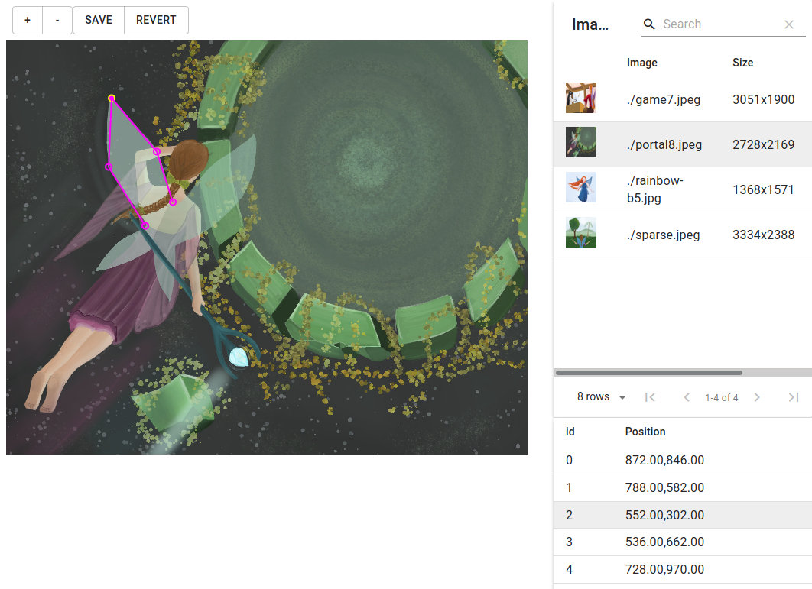

# Lablab

Simple image labeling tool. Written in Flask + React.




# Usage

Starting annotator:

```
python3 -m lablab serve /path/to/images
```

After that, open the browser at `http://localhost:3800`

# Import

Importing VOC files:

```
python3 -m lablab import /path/to/images
```

